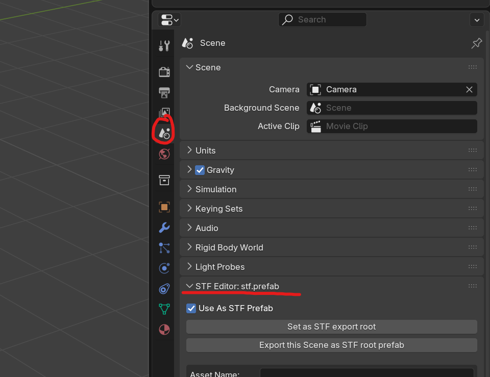
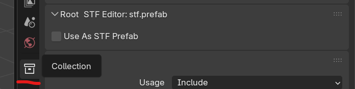
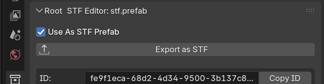
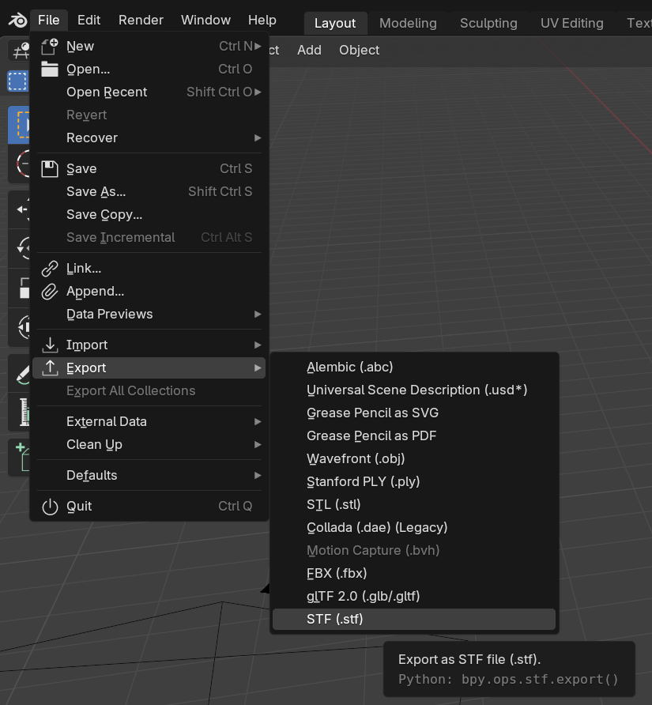
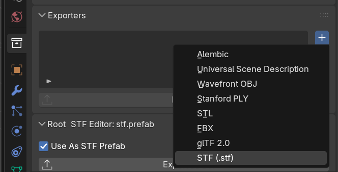
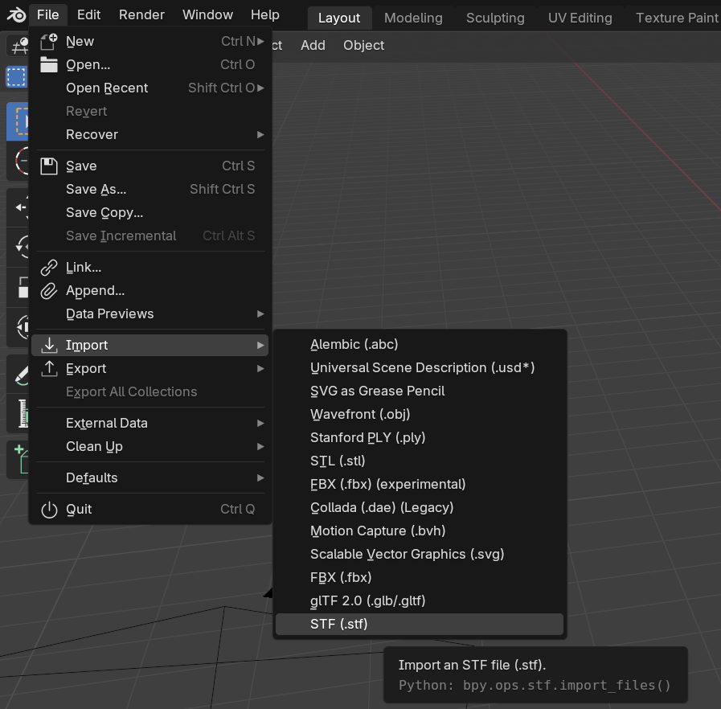

# STF Blender Import - Export

## Export
An STF asset is represented by a Blender Collection. By default the Scene Collection is used.

If you wish to use another one, select it and check `Use as STF Prefab` in the `STF Editor` panel.
If you click the `Set as STF export root` button, it will be automatically selected on export.

To export the desired Collection, simply press `Export as STF` on the Collection editor.

Alternatively you can go to `File` -> `Export` -> `STF (.stf)` and select your desired files there.

Blender Collection Exporters are also supported.

Anything parented to the Collection will be exported.

## Import
Simply drag'n drop one or more `.stf` files into Blender.\
Alternatively you can go to `File` -> `Import` -> `STF (.stf)` and select your desired files there.

When an STF file gets imported, it will become its own Collection.
