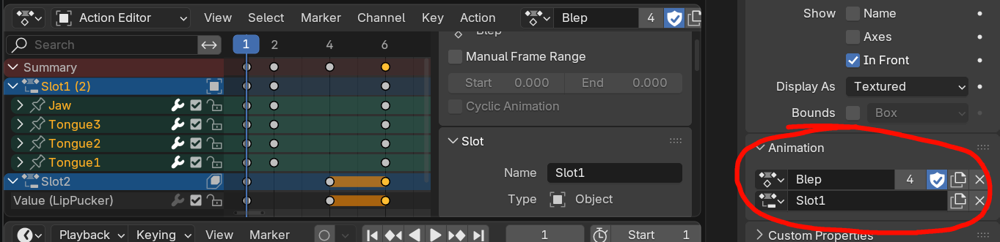
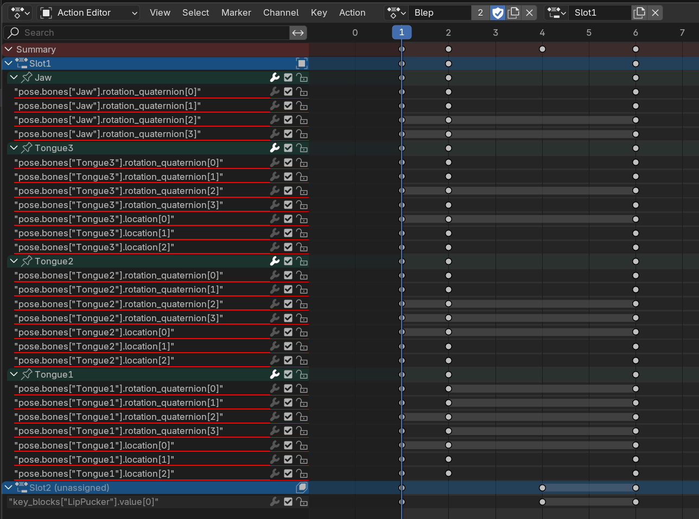
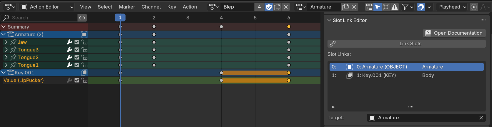

# Blender Slot Link

🌰 [Installation](https://extensions.blender.org/add-ons/slot-link/) 🌰 [Report Issues](https://codeberg.org/emperorofmars/blender_slot_link/issues) 🌰 [Source Code](https://codeberg.org/emperorofmars/blender_slot_link) 🌰

Slot Link helps you manage Blender projects with multiple separate animations.\
It automates the unlinking & linking of Actions and Slots, without requiring you to remember which goes where.

*Requires Blender 4.4 or higher. Not compatible with legacy Actions.*

## The Issue
In games-development, you often need to create multiple separate animations, that animate the same properties.\
*(I.e. a run-cycle and a walk-cycle for the same character.)*

This is unfortunately impossible to create in Blender without workarounds.\
*(As of version Blender 4.5)*

### Blender's Data Model
In Blender, animations are represented by Actions.\
Each animatable data-block (Object, Mesh, Armature, etc...) links to ***one*** Action and one of its Slots.
*(Actions only store the data-paths within that data-block)*

When you hit `spacebar`, which ever Actions and Slots are currently linked on all the data-blocks, will play.

Unfortunately, a data-block can link to only ***one*** Action.\
*Should you want to animate a walk-cycle and a run-cycle for the same character, you can't.*

In order to create a second Action, targeting the same data-blocks, you have to unlink the previous Action first.\
**After an Action has been unlinked, Blender no longer knows what it was animating.**

*(When unlinked, the Action knows which Bone and shape-key it animates, but not on which Armature-instance or Mesh!)*

If you need to edit the previous animation, you have to remember yourself where it and its Slots were linked, and restore that manually.

[This is a critical design flaw in Blender's data-model.\
While it doesn't inhibit Film and VFX use-cases, it severely limits the ability to create assets for video-games.]{.stf-info-box}

### Animation Export
Exporters, like those for FBX or glTF 2.0, do not have the knowledge of the artist.

In order to export the Actions, the targets of Actions and Slots have to be guessed.\
Depending on the circumstances, that may work well or fail completely.

### Error Prone UX
The Action displayed in the Action-Editor is linked to the animation-data of the selected data-block.\
This means, if you switch to another Action in the editor, the data-blocks linked Action will also change, and vice versa.

It's incredibly easy to accidentally and unknowingly mess up the scene.

When intentionally switching the edited action, the artist has to check every single data-block. Some Actions could have been previously linked somewhere accidentally.

## The Solution
The [Slot Link extension](https://extensions.blender.org/add-ons/slot-link/) automates the linking and unlinking of Actions and Slots.

First, you have to set the `Target` for each Slot.
[Slot Link purposely allows only Objects as targets.\
If you animated a Mesh's Shape Keys, simply select the Object on which that Mesh is instantiated.\
This has the added advantage of being able to animate instances of the same Mesh separately.]{.stf-info-box}

Select the desired Action in the Action-Editor, and press the `Link Slots` button. It will set the currently displayed Action for all data-blocks.\
It is no longer possible to accidentally change the displayed Action by just selecting another Object or Mesh.

The `Link Slots` button has to be pressed every single time you change the displayed Action.

[Note: Legacy Actions (without Slots) aren't supported.]{.stf-info-box}

### Import Export
With this information present, it is possible to deterministically import & export animations in Blender.

At the time of writing, the only importer/exporter that supports Slot-Link is STF. STF is not yet a production ready format.

Until STF matures, or an importer/exporter for another format implements support, Slot-Link still aids in the making of animations.

For export, you will still have to rely on automated guesswork.\
Alternatively, you can export animations one at a time. The `Link Slots` feature still significantly speeds that process up.

