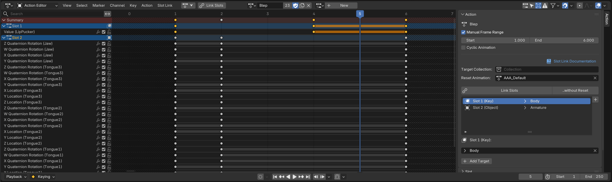
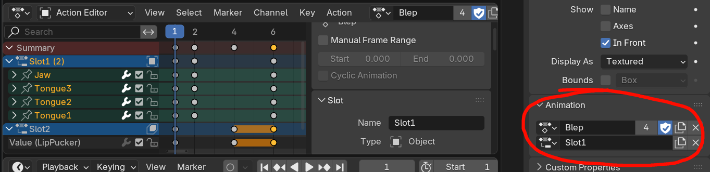
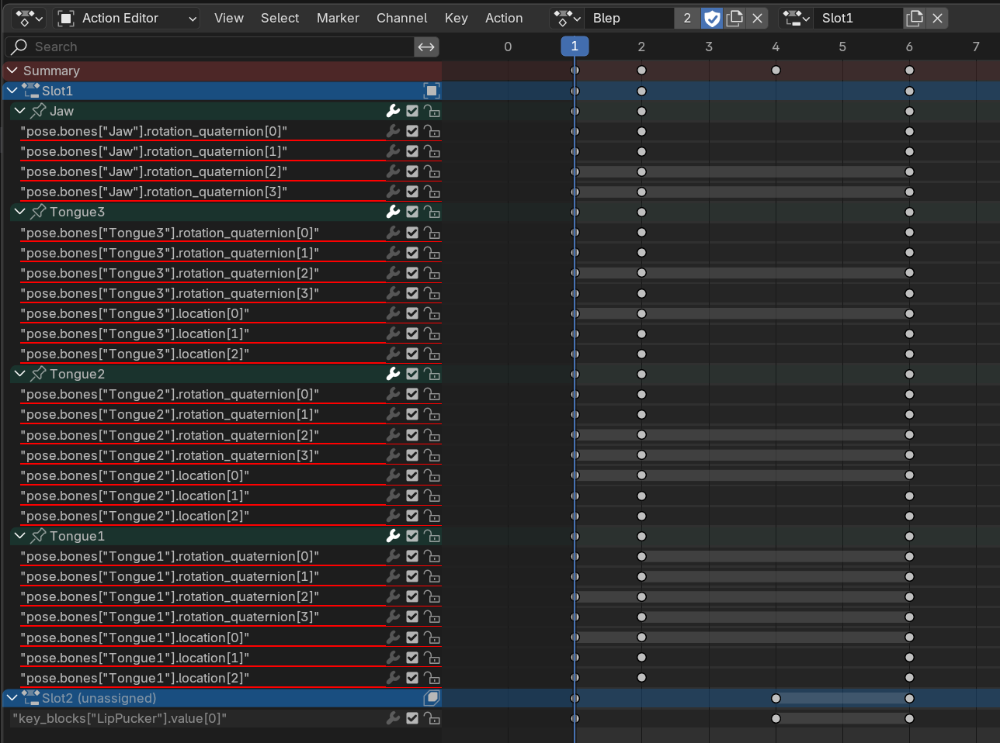

# Blender Slot Link

🌰 [Installation](https://extensions.blender.org/add-ons/slot-link/) 🌰 [Report Issues](https://codeberg.org/emperorofmars/blender_slot_link/issues) 🌰 [Source Code](https://codeberg.org/emperorofmars/blender_slot_link) 🌰

**Animation For Video Games Made Easy!**

*Requires Blender 4.5 or higher. Not compatible with legacy Actions.*

## The Issue
In games-development, you often need to create multiple separate animations, that animate the same properties.\
*(I.e. a run-cycle and a walk-cycle for the same character.)*

This is unfortunately impossible to create in Blender without workarounds.\
*(As of Blender version 5.2)*

**Blender supports only one animation per .blend file.**\
Actions are modular pieces from which the one animation is composed of.

## The Solution
**Slot Link redefines Actions to be full standalone animations.**\
To achieve that, you have to set the animation target for each Slot of an Action.



Open the `Dopesheet` editor and select the `Action Editor` mode.

* If you have **existing actions**, open the `Slot Link` dropdown menu and press `Setup all Actions`.
	This will setup links for all slots of all actions, and it will attempt to match a target if possible. Check each action yourself, and assign all empty targets manually in the action panel.
	```{image} img/slot_link/slot_link_autosetup.png
	:width: 350px
	```
* If you **create a new action**, press the highlighted `Prepare` button. Then start animating. Blender will create slots on your action automatically. For each created slot, select a target in the action panel.
	```{image} img/slot_link/slot_link_new_animation.png
	:width: 600px
	```

You purposely can't select meshes, armatures, materials, etc.. as targets. Instead, you select objects in the scenes hierarchy, on which those resources are instantiated.

:::{hint}
This brings the data-model closer to how game engines and other tools work, but it may not always replay correctly in Blender.

In case you animate the shape keys of a mesh-instance, Blender will play the animation on all instances of that mesh.
Animating two instances of the same mesh differently is impossible.\
This is unfixable with extensions and has to be addressed in Blender natively.\
*Please consider voting on the [Blender community issue](https://blender.community/c/rightclickselect/BO0X/?sorting=hot#).*
:::

Press `Link Slots` to link the action throughout the scene, and its slots to the specified targets. You can now play and edit the animation.
```{image} img/slot_link/slot_link_link.png
:width: 350px
```

By default, this will not touch the NLA. To also clear the NLA, in the operator options on the bottom left, select `Full Reset`.

Easily switch between animations. Either by pressing `Link Slots` after you use Blenders action selector, or you can use the super-powered animation selector left of the `Link Slots` button, in the header GUI.
```{image} img/slot_link/slot_link_selector.png
:width: 400px
```
Switching between Actions becomes a breeze, and it is no longer possible to accidentally change the active Action by just selecting another Object, Mesh etc...

### Reset Animation
Slot Link additionally allows you to specify whether an animation is intended to reset the Scene into a consistent state.\
The reset animation should consist of just one frame that animates all desired properties to their default value.

```{image} img/slot_link/slot_link_reset.png
:width: 350px
```

Further animations can select this animation as their reset.\
If so, when the `Link Slots` button is pressed, the reset animation will be applied right before the selected animation.

### Target Collection
If you wish to restrict an action to be linked only inside of one collection, select the `Target Collection`. All targets must be part of the selected collection.

### Clear Scene
If your animation behaves weirdly, you may have something pushed on the NLA. If that is unwanted, you can easily fix it by opening the `Slot Link` dropdown and pressing `Clear Scene`. In the bottom left operator options, select `Full Reset`, to also clear the NLA.

### Import Export
Slot link provides operators to setup all slot-linked animations onto the NLA in an export ready representation.\
A button to do that and immediately open the FBX exporter with the correct settings also exists.

```{image} img/slot_link/slot_link_export.png
```

Import into Slot Link is not yet supported.

:::{hint}
Slot Link is supported natively for import and export by [STF](https://docs.stfform.at), an experimental interchange format for games development.
:::

---

## Technical Details
In Blender, the animation is composed of all the Actions and Slots linked throughout the Scene.\
Each animatable data-block (Object, Mesh, Armature, etc...) links to ***one*** Action and one of its Slots.



When you hit the `spacebar`, which ever Actions and Slots are currently linked on all the data-blocks, will play.

Unfortunately, a data-block can link to only ***one*** Action.\
In order to create a second Action, targeting the same data-block, you have to remove the previous Action first.\
**After an Action has been unlinked, Blender no longer knows what it was animating.**


*(When unlinked, the Action knows which Bone and shape-key it animates, but not on which Armature-instance or Mesh!)*

If you need to edit the previous Action, you have to remember yourself where it and its Slots were linked, and restore that manually.

[This is a critical design flaw in Blender's data-model!\
While it doesn't inhibit film and VFX use-cases much, since all they need is the one animation, it severely limits the ability to create assets for video-games.]{.stf-info-box}

### Animation Export
Exporters, like those for FBX or glTF 2.0, do not have the knowledge of the artist.

In order to export Actions, the targets of Actions and Slots have to be guessed.\
Depending on the circumstances, that may work well or fail completely.

### Error Prone UX
The Action displayed in the Action-Editor is linked to the animation-data of the currently selected data-block.\
This means, if you switch to another Action in the editor, the data-block's linked Action is what actually changes, and vice versa.

If you select another Object/Mesh/etc, whichever Action was linked there, will become the active Action in the Action-Editor. Keyframes will be inserted there instead.
It is incredibly easy to accidentally and unknowingly animate the wrong Action.

