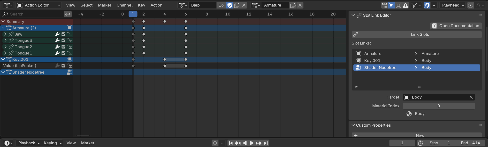

# Blender Slot Link

🌰 [Slot Link Installation](https://extensions.blender.org/add-ons/slot-link/) 🌰 [Report Issues](https://codeberg.org/emperorofmars/blender_slot_link/issues) 🌰 [Source Code](https://codeberg.org/emperorofmars/blender_slot_link) 🌰

Slot Link helps you manage Blender projects with multiple separate animations.

*Requires Blender 4.5 or higher. Not compatible with legacy Actions.*

## The Issue
In games-development, you often need to create multiple separate animations, that animate the same properties.\
*(I.e. a run-cycle and a walk-cycle for the same character.)*

This is unfortunately impossible to create in Blender without workarounds.\
*(As of Blender version 5.0)*

## The Solution
In the Action-Editor, specify with the [Slot Link extension](https://extensions.blender.org/add-ons/slot-link/) which Slot targets which Object and press `Link Slots`.

Whenever you change the active Action in the Action-Editor, simply press `Link Slots` to ensure the current Action is linked everywhere in the scene correctly.

Switching between Actions becomes a breeze, and it is no longer possible to accidentally change the active Action by just selecting another Object, Mesh etc...

:::{hint}
Slot Link purposely allows only Objects as targets.

If you animated a Mesh's Shape Keys, simply select the Object on which that Mesh is instantiated.

This has the added advantage of being able to animate instances of the same Mesh separately.
:::

### Import Export
With this information present, it is possible to deterministically import & export animations in Blender.

At the time of writing, the only importer/exporter that supports Slot-Link is [STF](https://docs.stfform.at). STF is not yet a production ready format.

Until STF matures, or an importer/exporter for another format implements support, Slot-Link still aids you in creating and managing of animations.

For export, you will for now have to rely on automated guesswork.\
Alternatively, you can export animations one at a time. The `Link Slots` feature still significantly speeds that process up.

---

## Technical Details
In Blender, an animation is represented by Actions.\
Each animatable data-block (Object, Mesh, Armature, etc...) links to ***one*** Action and one of its Slots.

When you hit `spacebar`, which ever Actions and Slots are currently linked on all the data-blocks, will play.

Unfortunately, a data-block can link to only ***one*** Action.\
In order to create a second Action, targeting the same data-block, you have to remove the previous Action first.\
**After an Action has been unlinked, Blender no longer knows what it was animating.**

*(When unlinked, the Action knows which Bone and shape-key it animates, but not on which Armature-instance or Mesh!)*

If you need to edit the previous Action, you have to remember yourself where it and its Slots were linked, and restore that manually.

[This is a critical design flaw in Blender's data-model!\
While it doesn't inhibit film and VFX use-cases much, since all they need is the one animation, it severely limits the ability to create assets for video-games.]{.stf-info-box}

### Animation Export
Exporters, like those for FBX or glTF 2.0, do not have the knowledge of the artist.

In order to export Actions, the targets of Actions and Slots have to be guessed.\
Depending on the circumstances, that may work well or fail completely.

### Error Prone UX
The Action displayed in the Action-Editor is linked to the animation-data of the selected data-block.\
This means, if you switch to another Action in the editor, the data-block's linked Action will also change, and vice versa.

Different data-blocks can link to different Actions, ensuring proper chaos. When you want to animate an Object/Mesh/etc.. that isn't selected currently, whichever Action is linked on that data-block will become active in the Action-Editor. Your keys will be added to that one, instead the one you wanted.

It's incredibly easy to accidentally and unknowingly mess up the scene and animations.

When intentionally switching the edited action, the artist has to check every single data-block. Some Actions could have been previously linked somewhere accidentally.
