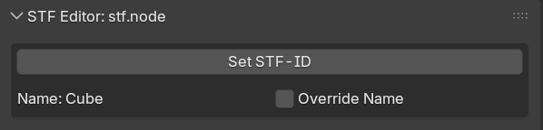
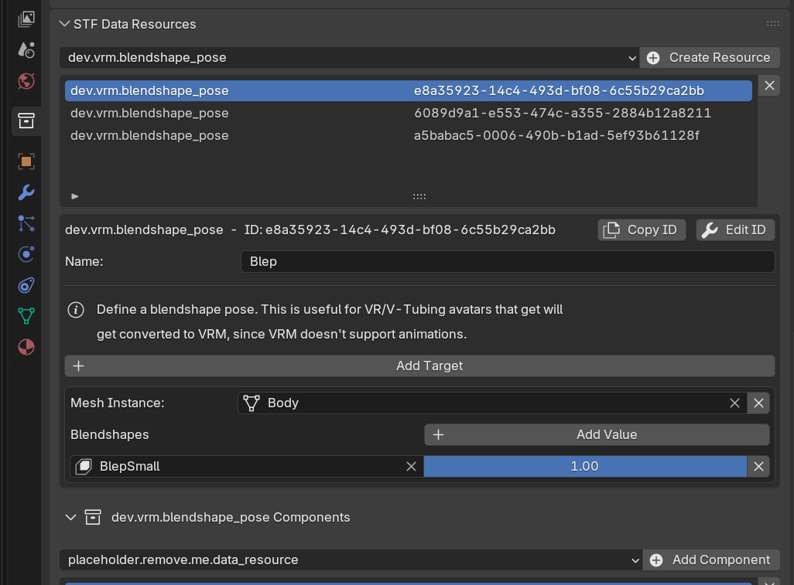
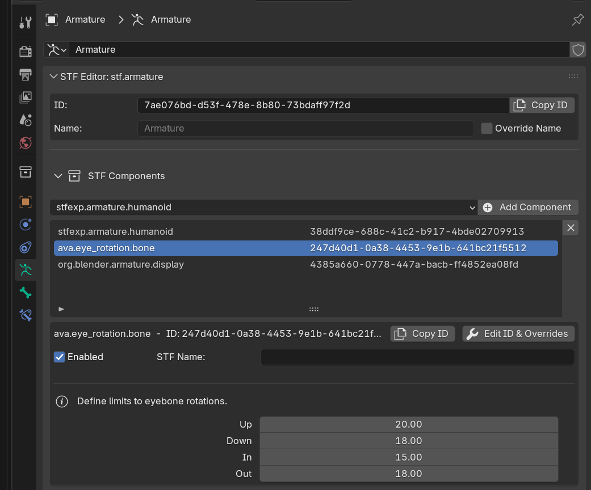

# STF Concepts in Blender

## Resources
An STF file consists of a hierarchy of arbitrary resources. These resources have a unique ID and a type and a name.

Many types can be natively represented by Blender:
* `stf.prefab` is represented by Blenders `Collection`.
* `stf.node` is represented by Blenders `Object`.
* `stf.mesh` is represented by Blenders `Mesh`.
* etc...

Each of these resources gets a properties panel to represent STF specific values, such as the unique ID.

If no ID is set before export, one will be automatically assigned. If STF encounters a duplicate ID, it will reassign it.

By default, the Blender name of a resource will be used. However, it can be optionally overridden.

Resources that Blender doesn't natively support and aren't components, can be created & edited in the **Data-Resources** panel in Collections. These can also have components.

## Components
In STF, resource have Components. These are 'sub-resources' which contain additional information/data for the parent resource.\
*I.e. the UV-seams on a mesh. They aren't stored by STF's `stf.mesh` resource directly, but can be added as a component.*

Some, like `stf.mesh.seams`, are natively supported by Blender, however most aren't, as they tend to represent more application-specific information.\
Components that are natively supported by Blender, will be automatically exported.

Components that aren't natively supported, can be added & edited in the `Components` section of each resources' panel.

<!--
## Blender Native Resources

### Collection - stf.prefab

### Object - stf.node

### Armature - stf.armature

### Bones - stf.bone

### Mesh - stf.mesh

### Material - stf.material

### Image - stf.image

### Action - stf.animation
-->
