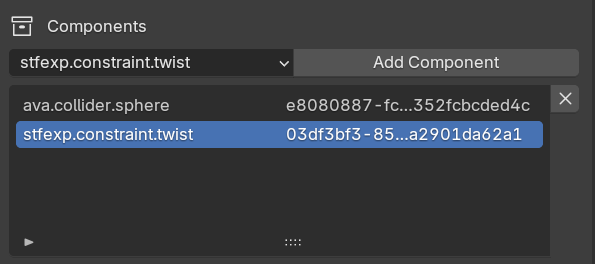

# STF Concepts in Blender

## Resources
Everything that can be exported in STF will get its own unique ID. If none is set before export, one will be automatically assigned. If STF encounters a duplicate ID, it will reassign it.

By default, the Blender name of a resource will be used. It can be optionally overridden.

## Component Resources
Resource have Components. These are 'sub-resources' which add additional information/data to their parent resource. Some, like mesh-seams, are natively supported by Blender, however most aren't.

Components can be added/edited in the `Components` section of each resources' panel.

<!--
## Blender Native Resources

### Collection - stf.prefab

### Object - stf.node

### Armature - stf.armature

### Bones - stf.bone

### Mesh - stf.mesh

### Material - stf.material

### Image - stf.image

### Action - stf.animation
-->
