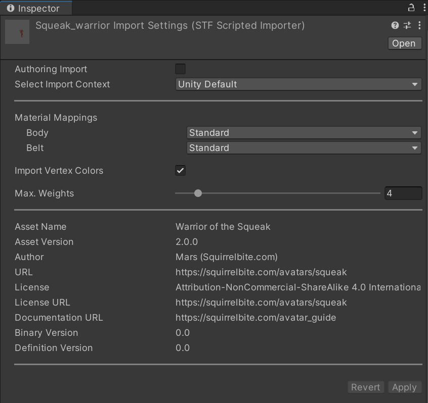

# Unity

🌰 [Installation](../installation/unity.md) 🌰 [Report Issues](https://codeberg.org/emperorofmars/stf_unity/issues) 🌰 [Source Code](https://codeberg.org/emperorofmars/stf_unity) 🌰

## Import Settings

Once you put an STF file within the `Assets` of you Unity project, you can select it to change the import settings in the inspector.

