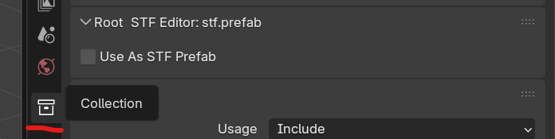
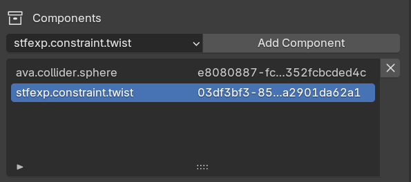

# STF Blender User Guide

## Export - Import

An STF asset is represented by a Blender Collection. By default the Scene Collection is used.

If you wish to use another one, select it and check `Use as STF Prefab` in the `STF Editor` panel.
If you click the `Set as STF export root` button, it will be automatically selected on export.

Anything parented to the Collection will be exported.

When an STF file gets imported, it will become its own Collection.

## Resources
Everything that can be exported in STF will get its own unique ID. If it is not set on before export, STF will automatically assign one. If STF encounters a duplicate ID, it will reassing it.\
By default the Blender name of a resource will be used. It can be optionally overridden.

## Component Resources
Resource have Components. These are 'sub-resources' which add additional information/data to their parent resource. Some, like mesh-seams are natively supported by Blender, however most arent.\
Components can be added/edited in the `Components` section of each resources panel.

<!--
## Blender Native Resources

### Collection - stf.prefab

### Object - stf.node

### Armature - stf.armature

### Bones - stf.bone

### Mesh - stf.mesh

### Material - stf.material

### Image - stf.image

### Action - stf.animation
-->
