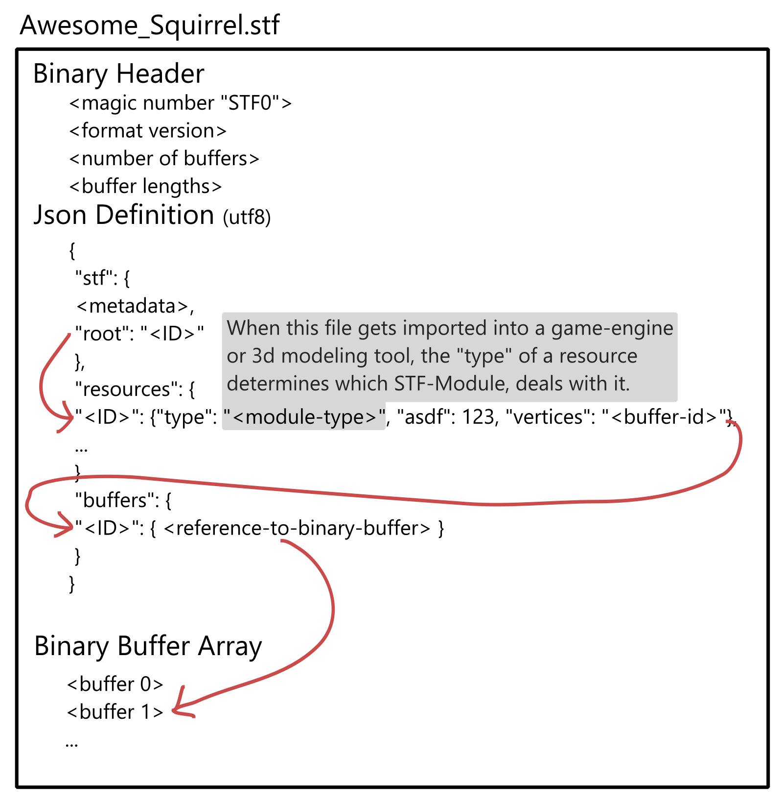

# STF - Squirrel Transfer Format

[A modular file-format for 3D assets]{.stf-subtitle}\
*Intended for (not only) games-development use-cases.*

:::{warning}
Please note, STF is work in progress and likely to change.
:::

**Install STF support for:**
::::{grid}

:::{grid-item-card} Blender
*Version 4.4+*

```{button-ref} installation/blender
:class: stf-button
:outline:
:expand:
Installation
```
```{button-ref} guides/blender/blender
:class: stf-button
:outline:
:expand:
User Guide
```
:::

:::{grid-item-card} Unity
*Version 2022.3+*

```{button-ref} installation/unity
:class: stf-button
:outline:
:expand:
Installation
```
```{button-ref} guides/unity
:class: stf-button
:outline:
:expand:
User Guide
```
:::

:::{grid-item-card} Godot
*Version 4.5+*

```{button-ref} installation/godot
:class: stf-button
:outline:
:expand:
Installation
```
```{button-ref} guides/godot
:class: stf-button
:outline:
:expand:
User Guide
```
:::

::::

{octicon}`zap` _Try to import this [example model](https://squirrelbite.itch.io/stf-avatar-showcase)!_

Relevant future implementation targets include: 3dsMax, Unreal Engine, Maya, Bevy, BabylonJs, ...

## Concept
STF by itself is merely a shell format. Its implementations provides a framework for different modules to parse and serialize resourses.

Resources are stored as Json-objects, identified by a unique ID. Resources can reference binary buffers and each other.

A few modules, including but not limited to [`stf.prefab`](modules/stf/stf_prefab.md), [`stf.mesh`](modules/stf/stf_mesh.md), [`stf.material`](modules/stf/stf_material.md) or [`stf.image`](modules/stf/stf_image.md), are provided by default.

Additional modules can be easily implemented by third parties. Each STF implementation must provide an easy and convenient way to hot-load module-plugins.

:::{note}
As the format is focussed on interoperability, the default module for meshes for example stores its data both, triangulated, and the original topology.
If it gets imported into a game-engine, the triangulated data will be used, if imported into a modeling tool, the original topology will be imported. This is possible with negligible storage impact.
:::

**Learn more in the [STF Format Reference](format/stf_format.md)**

Learn how STF compares to other 3d file-formats: [Comparisons](format/comparisons.md)

### Anatomy of an STF file



```{toctree}
:hidden:
Home <self>
installation/index.md
```

```{toctree}
:hidden:
:caption: Reference
format/stf_format.md
Modules <modules/index.md>
Comparisons <format/comparisons.md>
```

```{toctree}
:hidden:
:caption: Guides
guides/index.md
```
