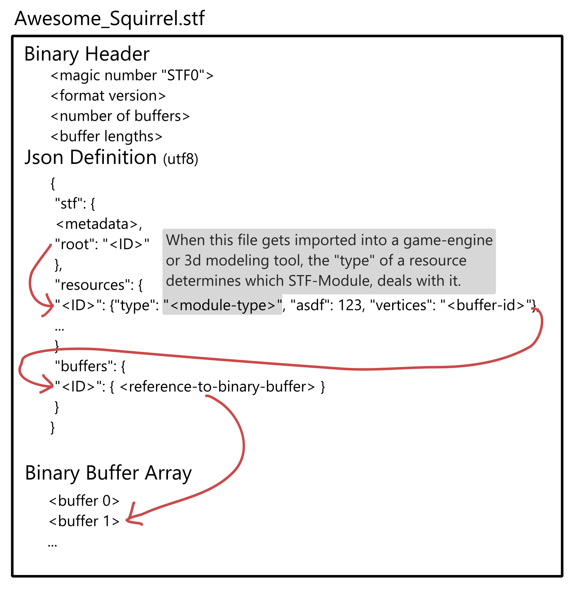

# STF - Squirrel Transfer Format

[A modular file-format for 3D assets]{.stf-subtitle}
*Intended for (not only) games-development use-cases.*

:::{warning}
Please note, STF is a work in progress and likely to change.
:::

<br>

**Install STF support for:**
::::{grid}

:::{grid-item-card} Blender
*Version 4.5+*
```{button-ref} installation/blender
:class: stf-button
:outline:
:expand:
Installation
```
```{button-ref} guide/blender
:class: stf-button
:outline:
:expand:
User Guide
```
:::

:::{grid-item-card} Unity
*Version 2022.3+*
```{button-ref} installation/unity
:class: stf-button
:outline:
:expand:
Installation
```
```{button-ref} guide/unity
:class: stf-button
:outline:
:expand:
User Guide
```
:::

:::{grid-item-card} Godot
*Version 4.6+*
```{button-ref} installation/godot
:class: stf-button
:outline:
:expand:
Installation
```
```{button-ref} guide/godot
:class: stf-button
:outline:
:expand:
User Guide
```
:::

::::

{octicon}`zap` _Try to import this [example model](https://squirrelbite.itch.io/stf-avatar-showcase)!_

[Relevant future implementation targets include: 3dsMax, Unreal Engine, Maya, Bevy, BabylonJs, ...]{.stf-info-box}


## Advantages
* **Artist Friendly**\
	Import & export is quick and you don't have to fiddle with unnecessary settings to avoid breakage.\
	[All information in STF and it's core-resources is normalized and doesn't require any knowledge about the file by the user.]{.stf-info-box}

* **Versatile**\
	STF stores original information as well as baked results.
	[*I.e. STF contains the original topology of meshes, including n-gons, but also the triangulation.*\
	This allows for STF files to be used for further editing **and** for import into game-engine editors.\
	Despite that, file-sizes remain similar and are sometimes even lower compared to other formats.]{.stf-info-box}

* **Easy to Develop**\
	STF's modular nature enables high encapsulation in the source-code and easy collaboration in the development of STF implementations.
	[A functioning implementation that handles some core resource-types can be usually developed in a day or two.\
	Third parties can easily develop and distribute custom (perhaps application specific) resources.]{.stf-info-box}


## Concept
STF by itself is merely a shell format. Its implementations provide a framework to parse and serialize arbitrary **resources**.

Resources are stored as Json-objects, and can represent anything, from nodes in a scene hierarchy, meshes, textures, animations, ...\
Resources are referenced by a unique ID.\
They and have a `type`, by which the appropriate piece of code, the resources' `handler`, is selected for import / export.

A few resources, including but not limited to [`stf.prefab`](resources/stf/stf_prefab.md), [`stf.mesh`](resources/stf/stf_mesh.md), [`stf.material`](resources/stf/stf_material.md) or [`stf.image`](resources/stf/stf_image.md), are provided by default.

It should be possible to extend any STF implementation with custom resource-handlers, if at all possible.

:::{seealso}
**Read the [STF Format Reference](format/stf_format.md)**

Learn how STF compares to other 3d file-formats: [Comparisons](format/comparisons.md)
:::

**Anatomy of an STF file**



```{toctree}
:hidden:
Home <self>
```

```{toctree}
:hidden:
:caption: Guides
Installation <installation/index.md>
Usage <guide/index.md>
```

```{toctree}
:hidden:
:caption: Reference
format/stf_format.md
STF Resources <resources/index.md>
Comparisons <format/comparisons.md>
```
