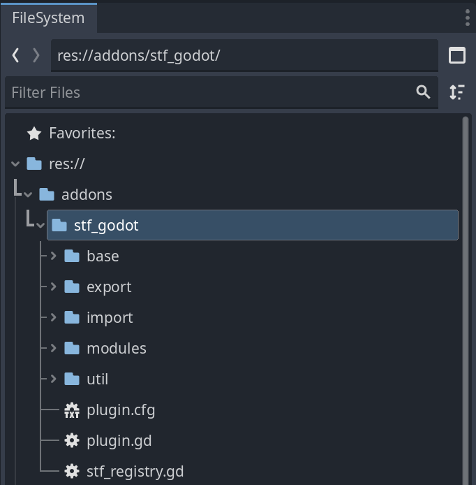
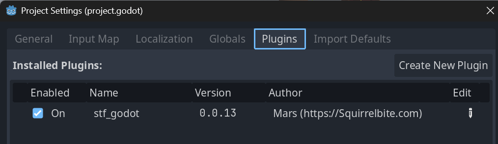

# Godot Installation

```{button-link} https://github.com/emperorofmars/stf_godot/releases/latest
:class: stf-button
Download the latest release
```

Unpack the `addons/stf_godot` directory from the downloaded zip file into the `addons` directory of your Godot project.

Your project's filesystem should look something like this:


Enable the addon under `Project` -> `Project Settings` -> `Plugins`



:::{tip}
Try to import this [example model](https://squirrelbite.itch.io/stf-avatar-showcase)!
:::

---

{octicon}`zap` _Try to import this [example model](https://squirrelbite.itch.io/stf-avatar-showcase)!_

🌰 [User Guide](../guide/godot.md) 🌰 [Report Issues](https://codeberg.org/emperorofmars/stf_godot/issues) 🌰 [Source Code](https://codeberg.org/emperorofmars/stf_godot) 🌰