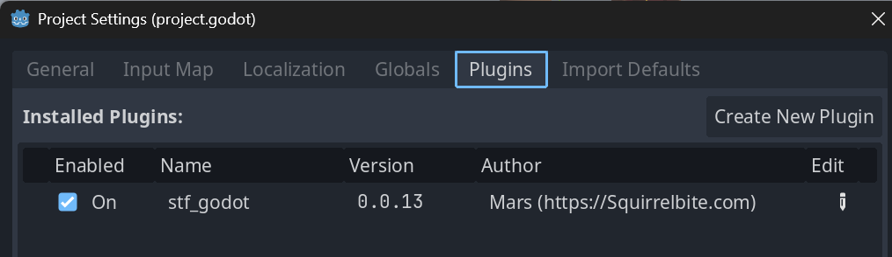

# Godot Installation

:::{warning}
Please note, STF is a work in progress and likely to change.
:::

```{button-link} https://store.godotengine.org/asset/mars/stf-godot/
:class: stf-button
Install from the Godot Asset Store
```

Enable the addon under `Project` -> `Project Settings` -> `Plugins`



:::{tip}
Try to import this [example model](https://squirrelbite.itch.io/stf-avatar-showcase)!
:::

---

{octicon}`zap` _Try to import this [example model](https://squirrelbite.itch.io/stf-avatar-showcase)!_

🌰 [User Guide](../guide/godot.md) 🌰 [Report Issues](https://codeberg.org/stf_format/stf_godot/issues) 🌰 [Source Code](https://codeberg.org/stf_format/stf_godot) 🌰
