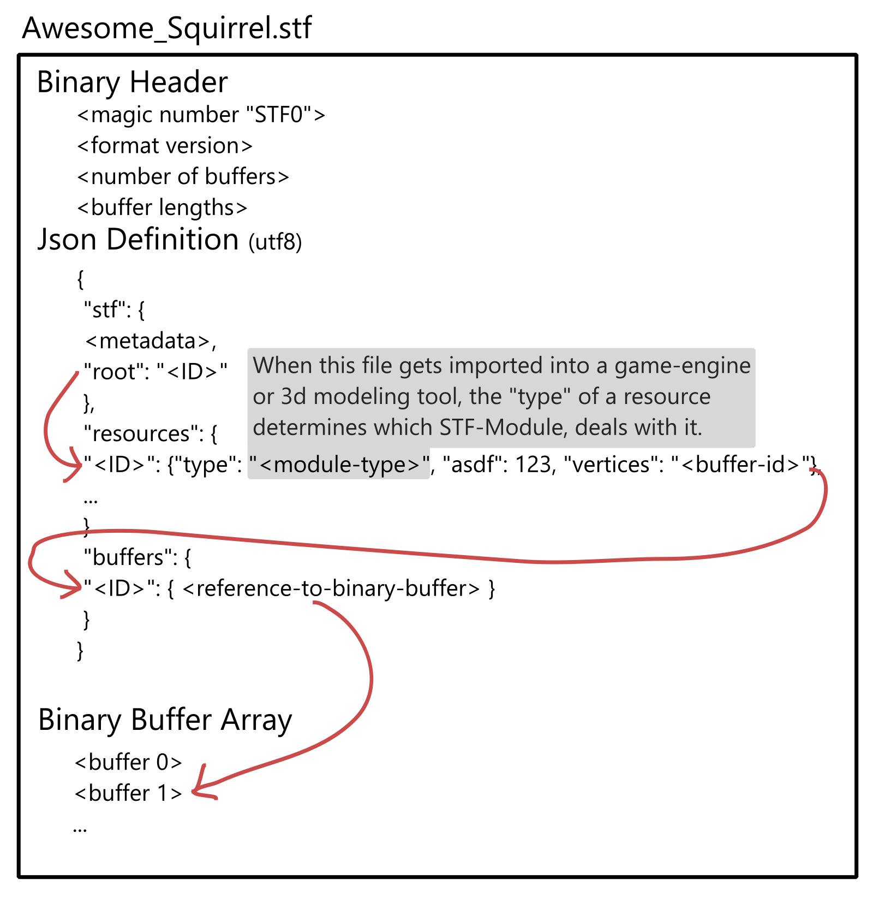

# STF - Squirrel Transfer Format
**A modular file-format for 3D assets**
*Intended for (not only) game development use-cases.*

Please note, STF is work in progress and likely to change.

**Get STF support for:**
* [Blender 4.4+](installation/blender.md)
* [Unity 2022.3+](installation/unity.md)
* [Godot 4.5+](installation/godot.md)

_Try to import this [example model](https://squirrelbite.itch.io/stf-avatar-showcase)!_

Relevant future implementation targets include: 3dsMax, Unreal Engine, Maya, Bevy, BabylonJs, ...

# Concept
STF by itself is merely a shell format. It provides a framework for different modules to parse and serialize resourses.

Resources are stored as Json-objects, identified by a unique ID. Resources can reference binary buffers and each other.

A few modules, including but not limited to `stf.prefab`, `stf.mesh`, `stf.material` or `stf.image`, are provided by default.

Additional modules can be easily implemented by third parties. Each STF implementation provides an easy and convenient way to hot-load module-plugins.

As the format is focussed on interoperability, the default module for meshes for example stores its data both, triangulated, and the original topology.
If it gets imported into a game-engine, the triangulated data will be used, if imported into a modeling tool, the original topology will be imported. This is possible with negligible storage impact.

Learn how STF compares to other 3d file-formats: [Comparisons](format/comparisons.md)

## Anatomy of an STF file

